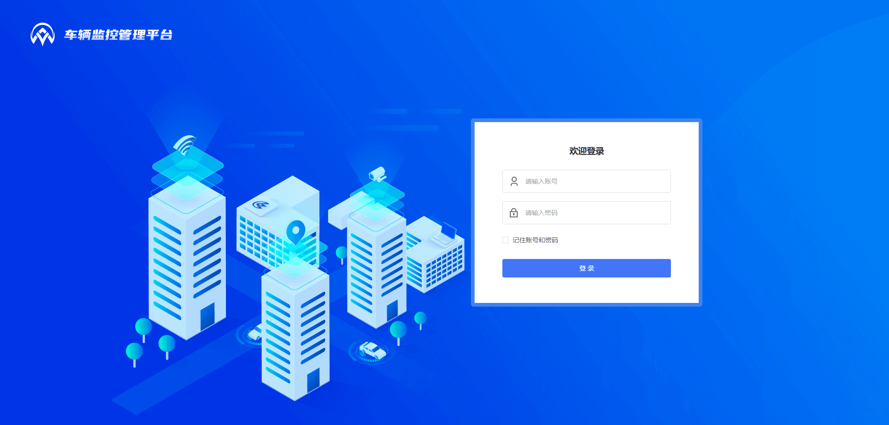
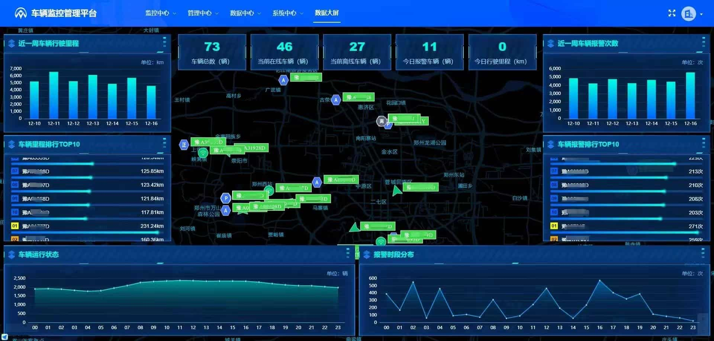
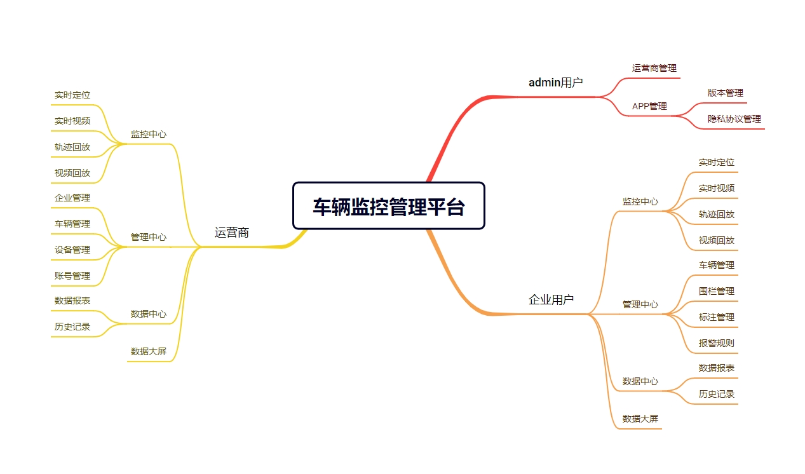
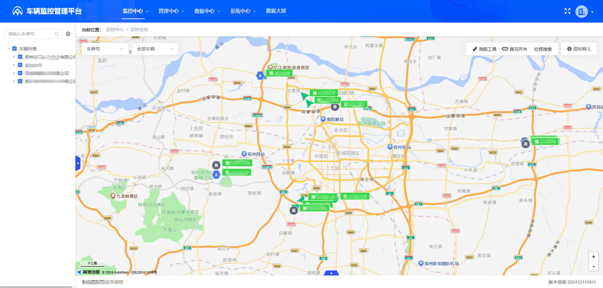
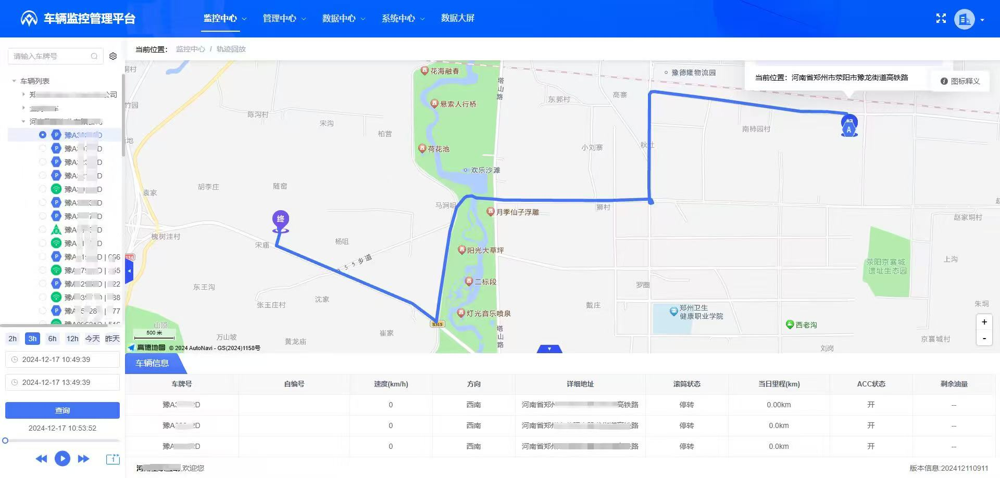
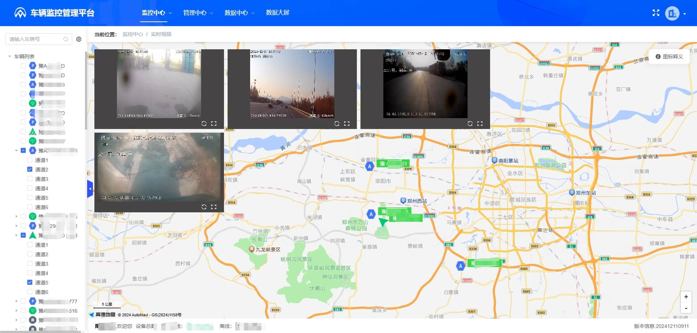
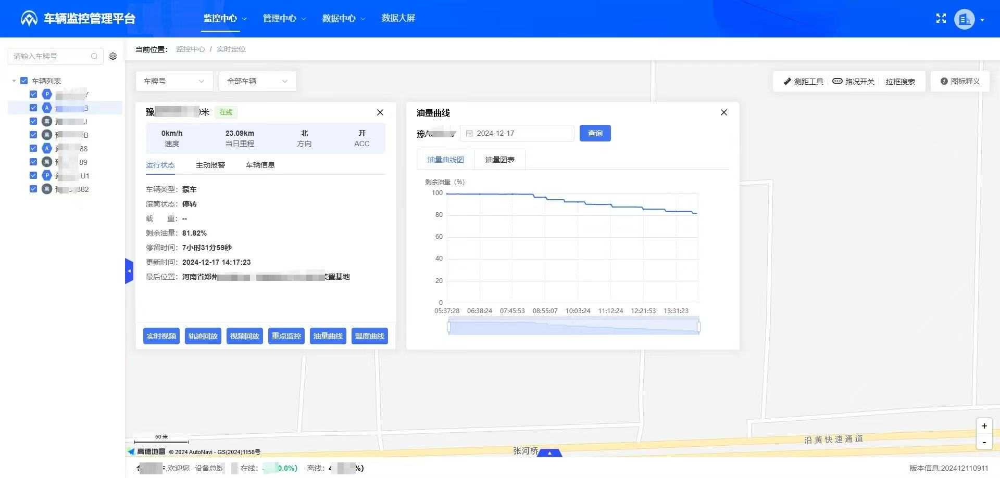

# 北斗/GPS车辆定位监控系统官网源码

基于 Vue 3 + Nuxt.js 构建的官方网站，支持 SEO 优化的静态站点生成。

演示地址：https://www.xlhd.info/

## 知识产权说明

- ✅ 您可以自由使用、修改、分发本项目的代码
- ✅ 您可以基于本项目进行二次开发和定制
- ⚠️ 本仓库中的图片是在花瓣购买的版权，您不得将本仓库图片用于商业用途或声称拥有本仓库图片的知识产权


# 北斗/GPS车辆定位监控系统介绍

该车辆动态监控系统基于jdk21，springboot3.5，netty4开发，支持jt808所有版本协议，jt809，jt1078，主动安全(ADAS/DSM)，支持锐明、有为、博实结、海康、大化、中天安驰等品牌的终端设备接入。

## 系统特性
* 系统代码按模块划分，便于二次开发
* 支持jtt808的2011、2013、2019协议版本
* 支持分包粘包处理，避免漏包、丢包，保证数据的可靠性
* 采用消息中间件的订阅发布处理，大大提升系统的吞吐量和可维护性
* 高并发、高稳定，4核16G基础服务器配置支撑10万并发（808基础数据+传感器数据）
* 提供样式精美、交互便捷的电脑 Web 端，支持安卓、iOS 和小程序等多平台的手机端，操作简单易用

## 协议支持
|协议名称|版本|是否支持|备注|
|---|---|---|---|
|JT/T 808|2011|支持|
|JT/T 808|2013|支持|
|JT/T 808|2019|支持|
|JT/T 1078|2016|支持||
|T/JSATL 12(主动安全-苏标)|2017|支持|基于JT/T808-2013|
|T/GDRTA 002(主动安全-粤标)|2019|支持|基于JT/T808-2019|

## 技术介绍
```
协议端(808/1078)：
    Netty4、Springboot3.5
业务端：
    jdk21、Springboot3.5、MySQL8、Redis、Kafka、Mongodb
Web端：
    vue3、typeScript3、vite2、elementPlus
移动端：
    uniapp
```

## 系统体验
* 登录账号：cctest
* 登录密码：abcd.1234
* 体验地址：[https://iov.xlhd.cloud/](https://iov.xlhd.cloud/)

## 版本介绍

| 功能模块 | 定位版 | 视频版 | 主动安全版 |
|---------|:------:|:------:|:------:|
| 实时定位 | ✓ | ✓ | ✓ |
| 历史轨迹 | ✓ | ✓ | ✓ |
| 实时视频 | <span style="color: red;">✗</span> | ✓ | ✓ |
| 视频回放 | <span style="color: red;">✗</span> | ✓ | ✓ |
| 主动安全-ADAS | <span style="color: red;">✗</span> | <span style="color: red;">✗</span> | ✓ |
| 主动安全-DSM | <span style="color: red;">✗</span> | <span style="color: red;">✗</span> | ✓ |
| 车辆管理 | ✓ | ✓ | ✓ |
| 车务管理 | ✓ | ✓ | ✓ |
| 排班调度 | <span style="color: red;">✗</span> | ✓ | ✓ |
| 围栏管理 | ✓ | ✓ | ✓ |
| 标注管理 | ✓ | ✓ | ✓ |
| 路线规划 | ✓ | ✓ | ✓ |
| 报警规则 | ✓ | ✓ | ✓ |
| 里程报表 | ✓ | ✓ | ✓ |
| 报警报表 | ✓ | ✓ | ✓ |
| 报警记录 | ✓ | ✓ | ✓ |
| 数据大屏 | ✓ | ✓ | ✓ |
| 企业管理 | ✓ | ✓ | ✓ |
| 账号管理 | ✓ | ✓ | ✓ |
| 设备管理 | ✓ | ✓ | ✓ |
| 接入协议 | ✓ | ✓ | ✓ |

## 系统截图










## 联系方式


